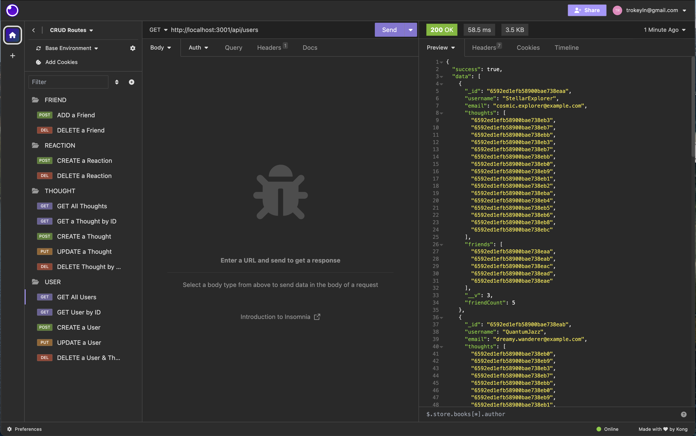
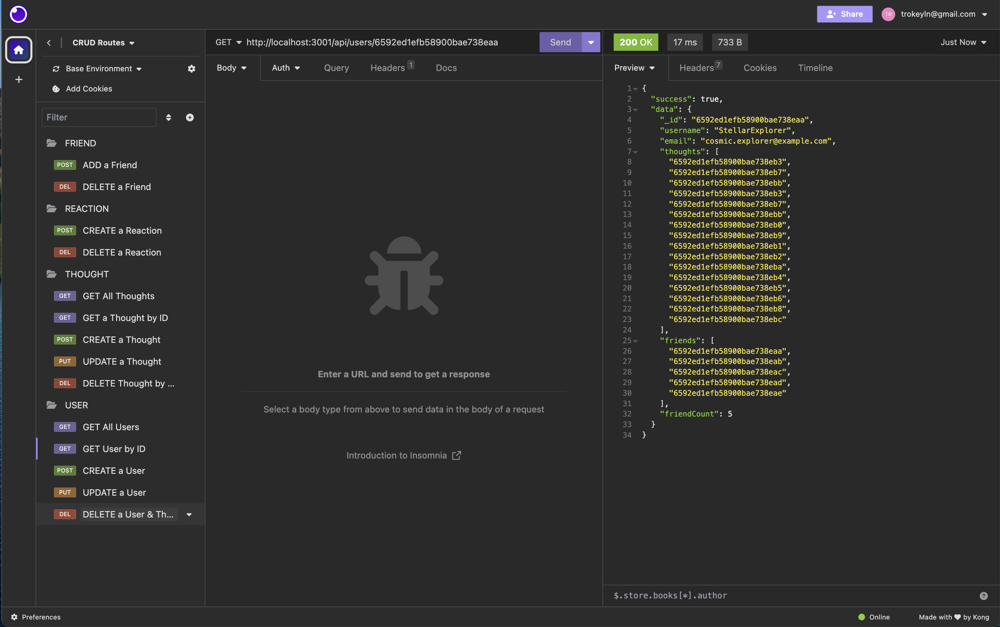
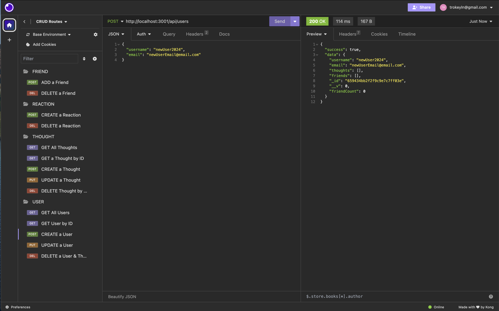
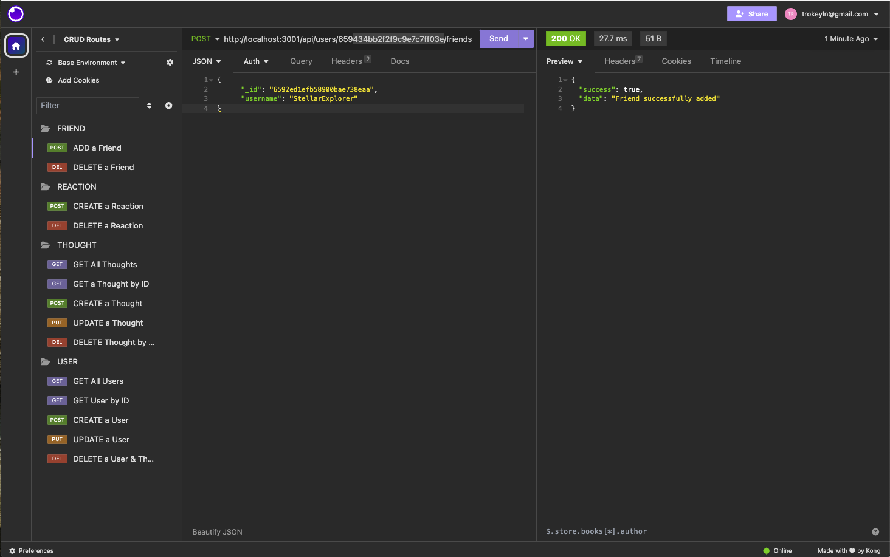
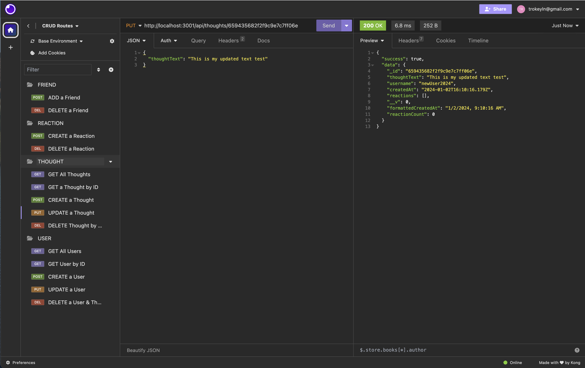
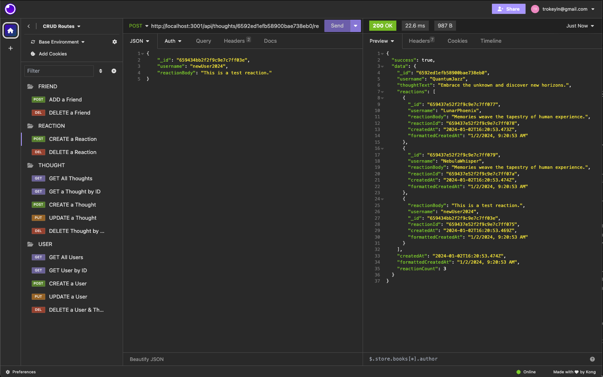
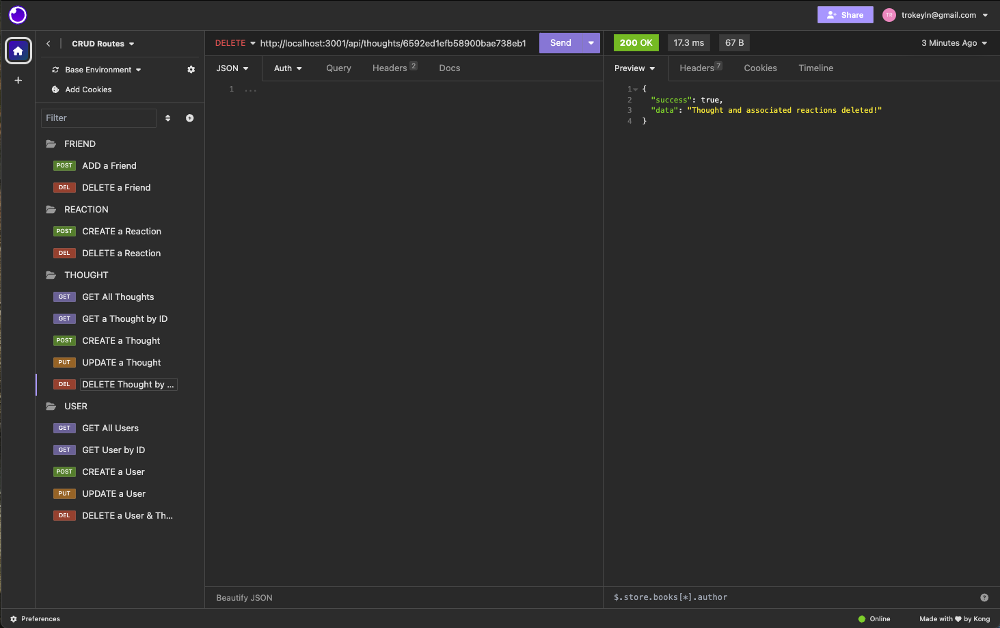

# Backend Social Network API (NoSQL)

[](https://opensource.org/licenses/MIT)

[Link to Presentation](add link here)

## Description

I developed a backend solution for a social network, crafting an API that utilizes a NoSQL database to efficiently manage large volumes of unstructured data. Leveraging technologies such as JavaScript, Node.js, Express.js, Mongoose, and MongoDB's Object Data Modeling (ODM), the API seamlessly syncs Mongoose models with the MongoDB database upon application invocation. Through extensive testing in Insomnia, the API demonstrates its functionality by successfully handling GET, POST, PUT, and DELETE routes for users, thoughts, reactions, and friend-related operations. The implementation ensures the smooth creation, updating, and deletion of users, thoughts, reactions, and friend connections, showcasing the scalability and reliability of the developed social network backend.

## Installation

1. **Clone the Repository**
   ```
   git clone https://github.com/ltrokey/cl_social_network_api
   cd cl_social_network_api
   ```
2. **Install Technologies**

   MongoDB - Visit the official MongoDB download page: [MongoDB Download Center](https://www.mongodb.com/try/download/community)

   Node.js - npm i

   Node.js - Dependencies

   - This application utilizes Node.js along with the following key dependencies:

   ```
       npm i express
       npm i mongoose@^7.0.0
       npm i mongoose-unique-validator
   ```

3. **Database Setup**

   - Start MongoDB Shell:

   ```
    mongosh
   ```

   By default, mongosh connects to a MongoDB server running on localhost at port 27017.

   - Seed Initial Data:

   ```
    npm run seed
   ```

4. **Configuration**
   - Update the connection settings in the config/connection.js as necessary.

## Usage

1. Run the Application

   - After following the installation instructions, execute the application by running the following command:

   ```
   npm start || nodemon server.js
   ```

2. Explore with Insomnia Core:

   - Open Insomnia Core to test and interact with the API routes.
   - Use the provided API routes for users, thoughts, friends or reactions to retrieve and manipulate data.
   - Ensure proper data formatting by checking the well-structured JSON responses.
   - Test API GET, POST, PUT, and DELETE routes to view, create, update, and delete data in the connected database.

   

   

   

   

   

   

   

## Badges


## Features:

**Express.js API:** A robust and functional Express.js API serves as the backbone of my social network platform, providing a seamless and responsive experience for your users.

**MongoDB and Mongoose Integration:** Seamlessly connect to your MongoDB database by configuring environment variables for your database connection, including the MongoDB URI. With Mongoose, database interactions become streamlined, facilitating effective data management.

**Database Initialization:** Simplify the initialization process by effortlessly creating and populating your development database with test data using straightforward schema and seed commands. This ensures that your database is adequately prepared for both development and testing phases.

**Automatic Model Sync with Mongoose:** When you launch your application, Mongoose automates the synchronization of models with your MongoDB database. This automates the handling and updating of your data model, providing a smooth and efficient experience for managing your MongoDB database.

**API Routes for Users, Thoughts, Friends, & Reactions:** Effortlessly retrieve data through API GET routes in tools like Insomnia Core. Categories, products, and tags are organized and displayed in a well-formatted JSON format, providing easy access to essential information.

**CRUD Operations:** Test and perform essential CRUD (Create, Read, Update, Delete) operations with ease. The API includes POST, PUT, and DELETE routes, allowing you to seamlessly manage and manipulate data in your database.

**Error Handling (200, 404, 500):** Comprehensive error handling ensures a smooth user experience. Proper handling of HTTP status codes 200 (OK), 404 (Not Found), and 500 (Internal Server Error) guarantees that your application gracefully manages success, client-side errors, and server-side errors.

## Questions

[GitHub Profile](https://github.com/ltrokey)

Please feel free to contact me via the email link below.

[Email](mailto:trokeyln@gmail.com)
